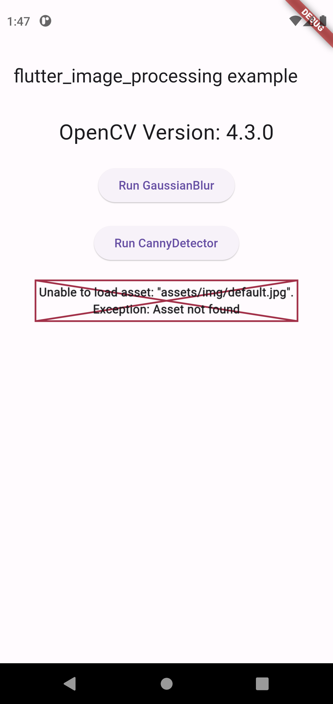
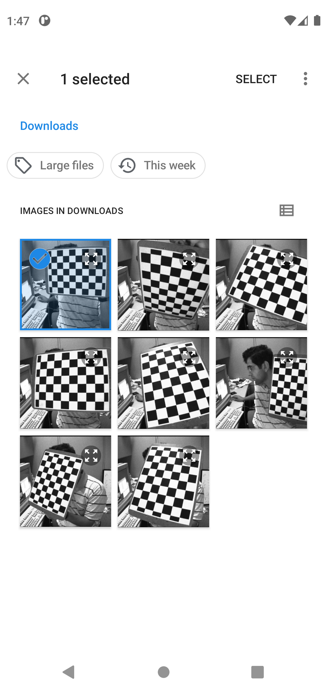
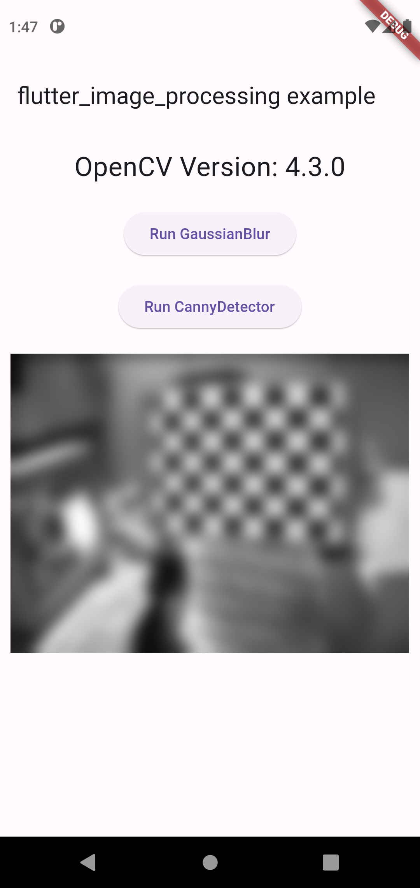
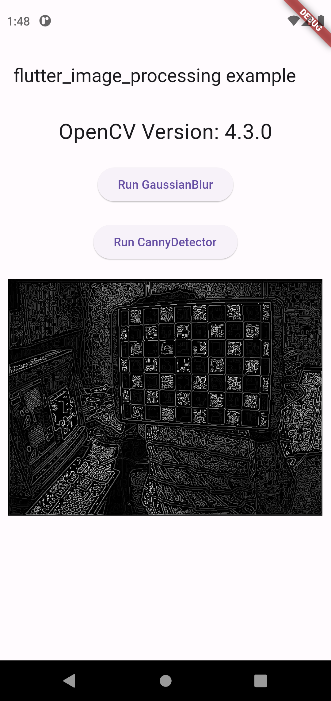

# flutter_image_processing

"flutter_image_processing plugin project."

## 1. Introduction

* The flutter_image_processing plugin project provides image processing functionality for iOS and Android using the OpenCV 4.3.0 library.


* This functionality is achieved by adapting the C++ image processing code provided in the OpenCV tutorials for use in Flutter.

  The project uses the FFI (Foreign Function Interface) library to bind these C++ functions for use in Flutter.

  At present, we offer only two functions: Gaussian Blur and Canny Edge Detector. 

  However, we plan to update and expand our capabilities using OpenCV by referring to OpenCV image processing tutorials in order to provide more functionalities in the future.


* In the example code, you will notice the usage of image_picker.


* Furthermore, please be aware that testing is not supported in the simulator when running the examples, and you should test them on an actual device.


## 2. Screenshots


| Home                            | Select Image                                    | Gaussian Blur Result                                           | Canny Edge Detector Result                                        |
|---------------------------------|-------------------------------------------------|----------------------------------------------------------------|-------------------------------------------------------------------|
|  |  |  |  |


## 3. Setup

* The permission settings required for image_picker can be found in the respective plugin installation documentation for iOS and Android.

## 4. Usage
```dart
import 'package:flutter_image_processing/flutter_image_processing.dart' as flutter_image_processing;

//get opencv version
var version = flutter_image_processing.opencvVersion();

final ImagePicker _picker = ImagePicker();

//Gaussian Blur
final imageFile = await _picker.pickImage(source: ImageSource.gallery);
final imagePath = imageFile?.path ?? "none";

await flutter_image_processing.gaussianBlur(imagePath);

//Canny Edge Detector
final imageFile = await _picker.pickImage(source: ImageSource.gallery);
final imagePath = imageFile?.path ?? "none";

await flutter_image_processing.cannyDetector(imagePath);

```

## - Reference -

* OpenCV Image Processing Tutorial: https://docs.opencv.org/4.3.0/d7/da8/tutorial_table_of_content_imgproc.html


* image picker: https://pub.dev/packages/image_picker


